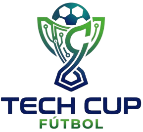
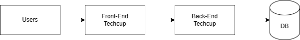
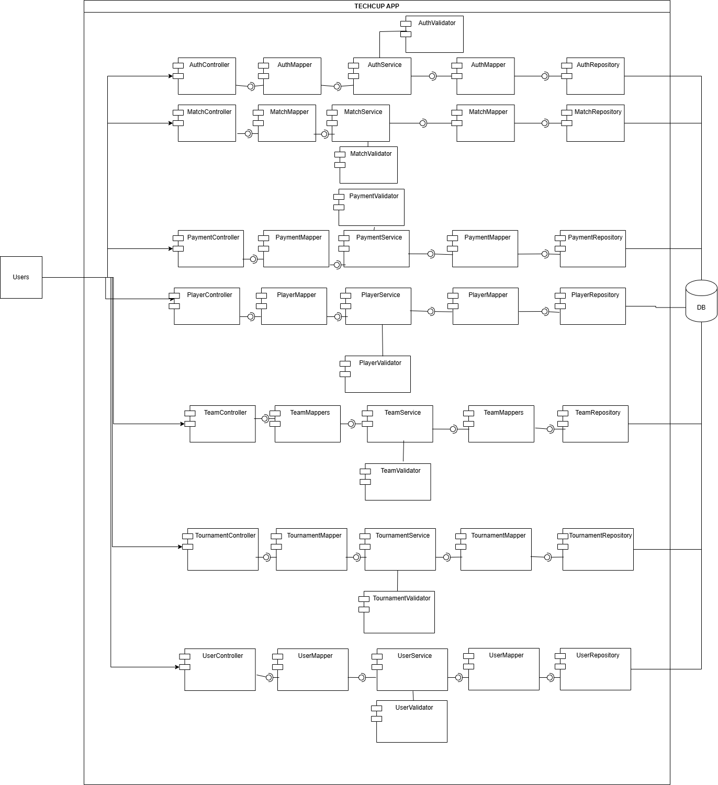
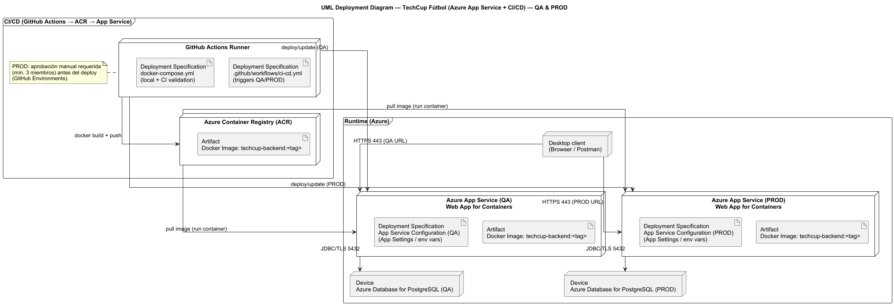
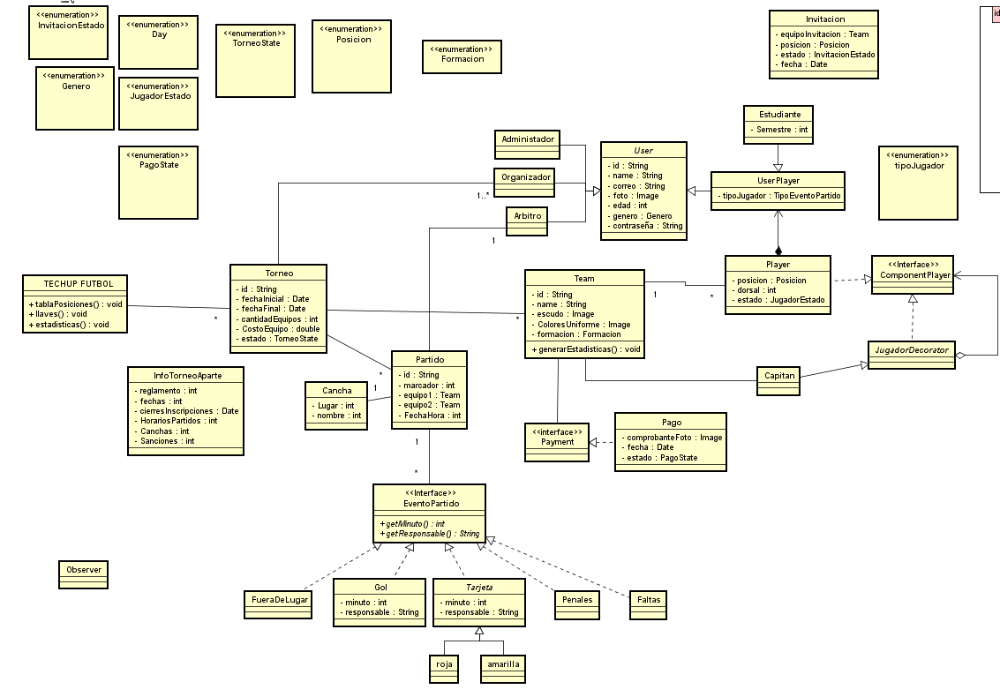
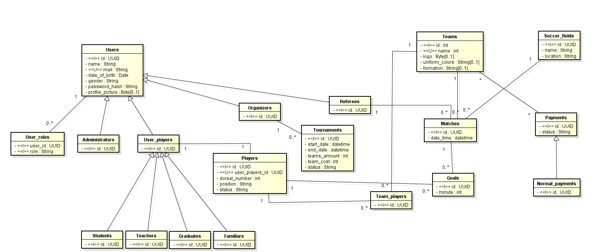

# HORUS EN OFFSIDE


## Integrantes

- Andres Felipe Cardozo
- Juan Camilo Cristancho
- Juan David Gómez
- Mariana Malagón
- Sebastian Castillejo 

## TechCup Fútbol

## Enunciado del problema

Actualmente, la organización de torneos estudiantiles de fútbol en la Escuela presenta retos significativos en la inscripción de equipos, registro de jugadores, manejo de pagos y seguimiento de resultados. No existe una plataforma integral que permita la gestión eficiente, segura y automatizada de todo el ciclo del torneo: desde la inscripción hasta la visualización de estadísticas y control disciplinario.

## Índice

1. [Diagrama de contexto del sistema](#diagrama-de-contexto-del-sistema)
2. [Definición de requerimientos](#definición-de-requerimientos)
    - [Funcionales](#requerimientos-funcionales)
    - [No funcionales](#requerimientos-no-funcionales)
3. [Análisis de requerimientos](#análisis-de-requerimientos)
4. [Arquitectura](#arquitectura)
5. [Manual de identidad](#manual-de-identidad)
6. [Jira: Gestión de tareas y funcionalidades](#jira)
7. [Diagramas de secuencia](#diagramas-de-secuencia)
8. [Diagrama de componentes general](#diagrama-de-componentes-general)
9. [Diagrama de componentes especificos](#diagrama-de-componentes-especificos)
10. [Diagrama de despliegue](#diagrama-de-despliegue)
11. [Diagrama de clases](#diagrama-de-clases)
12. [Diagrama entidad relación](#diagrama-entidad-relación)
13. [Sustento y justificación técnica](#sustento-y-justificación-técnica)
14. [Despliegue con Docker](#despliegue-con-docker)
---

## Diagrama de contexto del sistema


**Explicación:** Este diagrama delimita el sistema TECHCUP FÚTBOL y muestra cómo interactúan los actores principales con la plataforma. Resume el alcance funcional del proyecto: registro de usuarios, administración de perfiles deportivos, gestión de equipos, partidos, pagos, sanciones y consultas según el rol.

El sistema separa claramente los permisos por tipo de usuario. Los capitanes administran equipos e invitaciones, los organizadores controlan torneos, pagos y resultados, los árbitros consultan los partidos asignados y el administrador conserva capacidades de supervisión y auditoría.

También evidencia la integración con procesos externos como el pago y la carga de comprobantes, lo que permite trazabilidad y validación dentro del flujo de inscripción al torneo.

---

## Definición de requerimientos

### Requerimientos funcionales

### Requerimientos no funcionales

#### Documento de definición de requerimientos del sistema, donde se consolidan los requerimientos funcionales y no funcionales que delimitan el alcance del proyecto:
#### https://drive.google.com/file/d/1AOBtzUp4Ludo7ZzYN-Zx059rskGi4_KU/view?usp=sharing

## Análisis de requerimientos

#### Documento de análisis de requerimientos del sistema, donde se desarrollan y justifican las necesidades identificadas para el proyecto:  
#### https://1drv.ms/w/c/7d34c3acd28e130c/IQA1grpq8wYKT5Vyg6x0otSSAUKBbCGLtZLGRaYhcGPXc7Q?e=e3IsW9

---


## Arquitectura

#### Documento de arquitectura del sistema, donde se describe la estructura general de la solución, la organización de capas, los componentes principales y las decisiones técnicas adoptadas:
#### https://1drv.ms/w/c/7d34c3acd28e130c/IQAfWj_AG5bKT4UZDSs10honAU8gFO3hMa6E1Nb1qo87wek?e=cGd2Ee

---


## Manual de identidad
https://pruebacorreoescuelaingeduco.sharepoint.com/:p:/s/DOSW-2026-1/IQA1oPTMzFDaSpldO_fjkOzEAQrW69M2W3Ogkj8GeMJL3mQ?e=SzFiPT
Documento de manual de identidad visual, donde se definen los lineamientos de marca, colores, uso visual y presentación del proyecto.

---

## Jira

Tablero de Jira del proyecto, donde se organizan las tareas, funcionalidades y seguimiento del trabajo del equipo.
https://dosw-2026-01.atlassian.net/jira/software/projects/SCRUM/boards/1/backlog

---

## Diagrama de componentes general


**Explicación:** El diagrama de componentes general de TECHCUP FÚTBOL describe la arquitectura técnica del sistema en tres capas. El Front-End se comunica con el Back-End, luego se conecta directamente a la base de datos.

El Front-End concentra toda la interacción con el usuario: vistas, formularios y navegación. El Back-End centraliza la lógica de negocio, el procesamiento de datos y las reglas del torneo. La base de datos, implementada en PostgreSQL, persiste toda la información del sistema siguiendo el modelo relacional.

## Diagrama de componentes especificos


**Explicación:**Se detalla la estructura interna del Back-End, mostrando cómo se organiza cada módulo del sistema. Se identifican seis módulos principales: autenticación, partidos, pagos, jugadores, equipos, torneos y usuarios. Cada módulo sigue el mismo patrón de cuatro capas: un Controller que recibe las solicitudes del usuario, un Mapper que transforma los datos entre capas, un Service que ejecuta la lógica de negocio, y un Repository que se comunica directamente con la base de datos. Adicionalmente, cada módulo cuenta con un Validator independiente que verifica que los datos cumplan las reglas del negocio antes de ser procesados. Esta arquitectura aplica el principio de separación de responsabilidades: ninguna capa hace más de lo que le corresponde, lo que reduce el acoplamiento entre módulos y facilita el mantenimiento o reemplazo de cualquier parte sin afectar las demás. El uso de Mappers en ambos extremos del Service garantiza que los datos que entran y salen de la lógica de negocio estén siempre en el formato correcto, desacoplando la representación interna de la externa.

## Diagrama de despliegue (Azure + CI/CD) — QA & PROD




El siguiente **diagrama de despliegue UML** muestra la arquitectura de ejecución del sistema **TechCup Fútbol** en Azure, incluyendo los **nodos/dispositivos**, los **enlaces de comunicación** entre ellos y la **colocación de los artefactos de software** en cada entorno.

### Componentes principales (según notación UML)

- **Node: GitHub Actions Runner (CI/CD)**  
  Representa el entorno donde se ejecuta el pipeline de integración y despliegue continuo.  
  Dentro de este nodo se encuentran las **Deployment Specifications**:
    - `.github/workflows/ci-cd.yml`: define el flujo de CI/CD (triggers, jobs y pasos) para **QA** y **PROD**.
    - `docker-compose.yml`: se utiliza para **orquestar/validar** servicios durante pruebas locales o validaciones en CI (por ejemplo, pruebas de integración).

- **Node: Azure Container Registry (ACR)**  
  Registro donde se almacena el **Artifact** principal del despliegue:
    - **Docker Image** `techcup-backend:<tag>`.

- **Node: Azure App Service (QA) / Azure App Service (PROD)**  
  Son los entornos de ejecución (Web App for Containers) donde corre el backend como contenedor.  
  En cada App Service se incluyen:
    - **Artifact**: la imagen Docker `techcup-backend:<tag>` que se ejecuta en el servicio.
    - **Deployment Specification**: configuración del App Service por ambiente (App Settings / variables de entorno), usada para parametrizar credenciales y valores (por ejemplo, variables `DB_*`, secrets, etc.).

- **Device: Azure Database for PostgreSQL (QA) / (PROD)**  
  Bases de datos administradas en Azure, separadas por ambiente, a las cuales se conecta la aplicación.

- **Desktop client (Browser/Postman)**  
  Representa al consumidor del sistema (usuario o cliente) que realiza solicitudes HTTP hacia la API.

### Interacción y flujo (comunicación)

1. **CI/CD: build y publicación del artefacto**
    - GitHub Actions ejecuta el pipeline y realiza `docker build + push` hacia **ACR**.
    - La imagen resultante queda almacenada como `techcup-backend:<tag>` en el registro.

2. **Despliegue a QA y PROD**
    - El pipeline realiza `deploy/update` para cada ambiente (QA y PROD), actualizando la versión/tag del contenedor a usar.
    - Cada **App Service** obtiene la imagen desde ACR mediante `pull image (run container)` y ejecuta el contenedor.

3. **Acceso del cliente**
    - El cliente se comunica con la aplicación en cada ambiente a través de **HTTPS 443** (QA URL y PROD URL).

4. **Conexión a base de datos**
    - La aplicación en **QA** se conecta a **PostgreSQL (QA)** mediante **JDBC/TLS 5432**.
    - La aplicación en **PROD** se conecta a **PostgreSQL (PROD)** mediante **JDBC/TLS 5432**.

### Control de despliegue en producción
Para el ambiente **PROD** se contempla una política de aprobación manual antes de desplegar (GitHub Environments), requiriendo la aprobación de al menos **3 miembros** del equipo.

## Diagrama de clases


**Explicación:** Este diagrama representa el modelo de dominio del proyecto y las relaciones entre sus entidades principales. Muestra cómo se conectan usuarios, perfiles deportivos, equipos, invitaciones, torneos, partidos, pagos y sanciones.

Su objetivo es dejar claras las cardinalidades, herencias y asociaciones que soportan las reglas de negocio del sistema, especialmente las restricciones de roles, pertenencia a equipos y seguimiento de resultados.

---

## Diagrama entidad relación 


**Explicación:** El diagrama entidad-relación de TECHCUP FÚTBOL define cómo se estructura y persiste la información del sistema en PostgreSQL. Se identifican las siguientes entidades principales: usuarios, jugadores, equipos, árbitros, organizadores, administradores, torneos, partidos, canchas, goles y pagos.

El diseño aplica 3FN, eliminando redundancias y dependencias transitivas entre atributos. Esto se refleja en decisiones como centralizar los datos personales en una única tabla de usuarios y derivar los roles desde ella, o separar la relación entre jugadores y equipos en una tabla puente independiente. Cada entidad almacena únicamente la información que le corresponde, lo que garantiza consistencia, menor duplicación de datos y mayor facilidad de mantenimiento a medida que el sistema escala.

Entidades principales: users, players, teams, referees, organizers, tournaments, matches, soccer_fields, goals, payments. Relaciones clave: un organizador crea uno o varios torneos, los equipos se inscriben a través de team_players, cada partido ocurre en una cancha con un árbitro asignado, y los goles quedan registrados con el minuto exacto dentro de su partido correspondiente.

## Diagramas de secuencia

Documento técnico de diagramas de secuencia, donde se agrupan los flujos de interacción del sistema por módulo funcional. Puedes consultarlo aquí:

[Ver documento de diagramas de secuencia](./docs/UML/secuencia/README.md)

## Sustento y justificación técnica

En este repositorio no sólo se encontrará los artefactos básicos, sino también el razonamiento y análisis detrás de cada decisión:
- Cada requerimiento fue discutido y agrupado según las necesidades de bajo acoplamiento, alta cohesión y escalabilidad del sistema.
- Los módulos y funcionalidades fueron definidos tras analizar los flujos críticos del torneo estudiantil.
- El diseño visual y la lógica de roles se fundamentaron en principios de seguridad, usabilidad y la experiencia previa en sistemas similares.

---

## Despliegue con Docker

### Prerrequisitos

- [Docker](https://www.docker.com/get-started) instalado
- [Docker Compose](https://docs.docker.com/compose/install/) instalado
- Archivo `.env` configurado (ver `.env.example`)

### Configuración inicial


1. Crea tu archivo `.env` a partir del ejemplo:
```bash
cp .env.example .env
```

2. Edita el `.env` con tus valores reales (credenciales, secretos, etc.).

### Levantar el entorno local

```bash
docker-compose up --build
```

Esto levanta dos servicios:
- **db** — PostgreSQL 16 en el puerto `5432`
- **backend** — Spring Boot en el puerto `8443` (HTTPS)

### Verificar que está corriendo

```bash
docker-compose ps
```

Accede a la API en: `https://localhost:8443`

### Detener el entorno

```bash
docker-compose down
```

Para eliminar también los datos de la base de datos:
```bash
docker-compose down -v
```

### Estructura de archivos Docker

```
TechUpFutbol_Backend/
├── Dockerfile          # Imagen del backend
├── docker-compose.yml  # Orquestación de servicios
├── .dockerignore       # Archivos excluidos de la imagen
├── .env                # Variables de entorno reales (no subir al repo)
└── .env.example        # Plantilla de variables de entorno
```

### Notas importantes

- El archivo `.env` **nunca debe subirse al repositorio**. Está incluido en `.gitignore` y `.dockerignore`.
- El backend espera que la base de datos esté disponible antes de arrancar (healthcheck configurado).
- Los logs se guardan en la carpeta `logs/` del proyecto.
