# HORUS EN OFFSIDE


## Integrantes

- Andres Felipe Cardozo
- Juan Camilo Cristancho
- Juan David Gómez
- Mariana Malagón
- Sebastian Castillejo 

## TechCup Fútbol

## Enunciado del problema

Actualmente, la organización de torneos estudiantiles de fútbol en la Escuela presenta retos significativos en la inscripción de equipos, registro de jugadores, manejo de pagos y seguimiento de resultados. No existe una plataforma integral que permita la gestión eficiente, segura y automatizada de todo el ciclo del torneo: desde la inscripción hasta la visualización de estadísticas y control disciplinario.

## Índice

1. [Diagrama de contexto del sistema](#diagrama-de-contexto-del-sistema)
2. [Definición de requerimientos](#definición-de-requerimientos)
    - [Funcionales](#requerimientos-funcionales)
    - [No funcionales](#requerimientos-no-funcionales)
3. [Análisis de requerimientos](#análisis-de-requerimientos)
4. [Mockup](#mockup)
5. [Manual de identidad](#manual-de-identidad)
6. [Jira: Gestión de tareas y funcionalidades](#jira)
7. [Diagrama de componentes general](#diagrama-de-componentes-general)
8. [Diagrama de componentes especificos](#diagrama-de-componentes-especificos)
9. [Diagrama de clases](#diagrama-de-clases)
---

## Diagrama de contexto del sistema


Explicación técnica del diagrama y las decisiones tomadas

El diagrama de contexto de TECHCUP FÚTBOL representa las principales interacciones entre los distintos actores del torneo y el sistema central. Se identifican los siguientes actores: estudiantes, profesores, graduados, personal administrativo, familiares, capitanes, árbitros, organizador y administrador. Cada uno cuenta con accesos y permisos específicos según su rol.

Las decisiones de diseño se fundamentan en la necesidad de ofrecer una plataforma que cubra todo el ciclo del torneo, desde la inscripción y gestión de perfiles hasta la administración de equipos, partidos y pagos. Se integró un mecanismo externo de pago (NEQUI/Efectivo), donde los usuarios realizan el pago y luego cargan el comprobante al sistema, asegurando trazabilidad y validación por parte del organizador.

El sistema distingue funcionalidades según el perfil del usuario; por ejemplo, el capitán puede crear y administrar equipos, buscar jugadores y enviar invitaciones, mientras que el organizador gestiona el calendario, pagos y resultados. Asimismo, el árbitro solo accede a la programación de los partidos asignados, y el administrador tiene control total y capacidades de auditoría.

Estas decisiones garantizan una separación clara de responsabilidades, menor acoplamiento y mayor cohesión entre módulos, contribuyendo a la seguridad, escalabilidad y facilidad de uso del sistema. Además, se facilita la integración con sistemas externos y el cumplimiento de requisitos administrativos del evento.

Entradas principales: solicitudes de inscripción, edición de perfil, creación de equipos, envío de invitaciones, subida de comprobantes de pago, configuración de torneo, registro de resultados y sanciones.
Salidas principales: confirmaciones, notificaciones, reportes de estado, listas de partidos asignados, información de equipos y jugadores filtrados, acceso a auditorías y resúmenes administrativos.

---

## Definición de requerimientos

### Requerimientos funcionales
### Requerimientos no funcionales

#### Por extensión y claridad, este análisis se presenta en un documento aparte: 
#### https://drive.google.com/file/d/1AOBtzUp4Ludo7ZzYN-Zx059rskGi4_KU/view?usp=sharing
---

## Análisis de requerimientos

#### Por extensión y claridad, este análisis se presenta en un documento aparte:  
#### https://1drv.ms/w/c/7d34c3acd28e130c/IQCAH7ImRPTqSYfQUhoapmEbAbOVB6q0QP5HCngxcs08icQ?e=9O5Xbh


---

## Mockup

Enlace directo al prototipo de Figma:

https://www.figma.com/design/tDLGUeXBQ7ROjQXduZtsp3/TechCup-Futbol?node-id=0-1&t=IKqSkDNZFQwFqz1A-1


Explicación:
Propuesta inicial de la aplicacion donde resaltamos cantidad de pantallas y flujos.

---

## Manual de identidad
https://pruebacorreoescuelaingeduco.sharepoint.com/:p:/s/DOSW-2026-1/IQA1oPTMzFDaSpldO_fjkOzEAQrW69M2W3Ogkj8GeMJL3mQ?e=SzFiPT
Explicación: 
Manual de identidad donde definimos nuestra marca y se encuentra el enlace a presentacion.

---

## Jira: Gestión de tareas y funcionalidades

https://dosw-2026-01.atlassian.net/jira/software/projects/SCRUM/boards/1/backlog


---

## Diagrama de componentes general


## Diagrama de componentes especificos


## Diagrama de clases


## Sustento y justificación técnica

En este repositorio no sólo se encontrará los artefactos básicos, sino también el razonamiento y análisis detrás de cada decisión:  
- Cada requerimiento fue discutido y agrupado según las necesidades de bajo acoplamiento, alta cohesión y escalabilidad del sistema.
- Los módulos y funcionalidades fueron definidos tras analizar los flujos críticos del torneo estudiantil.
- El diseño visual y la lógica de roles se fundamentaron en principios de seguridad, usabilidad y la experiencia previa en sistemas similares.

---

## Diagramas de Secuencia

### Módulo 1 (Usuarios y perfiles deportivos)

| Diagrama | Descripción |
|----------|-------------|
| 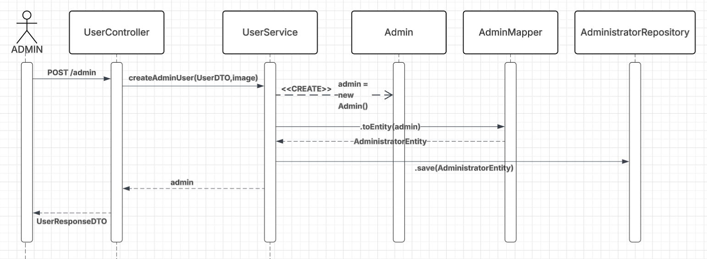 | Crear usuario administrador |
| 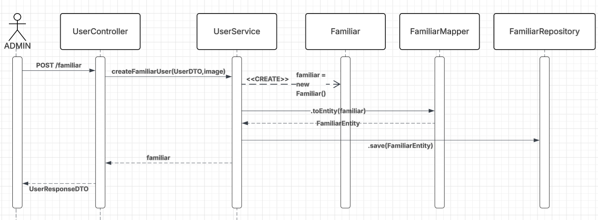 | Crear usuario familiar |
| 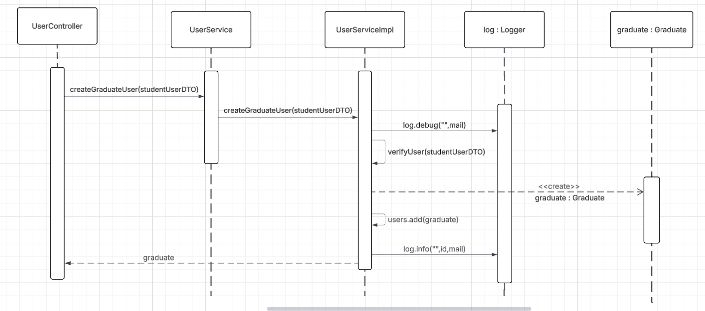 | Crear usuario egresado |
| 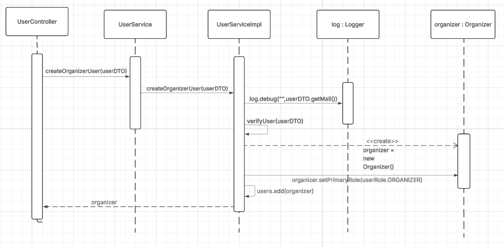 | Crear usuario organizador |
| 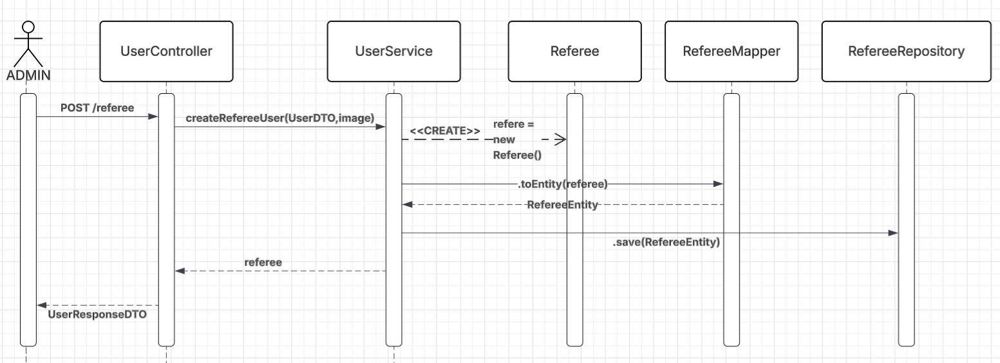 | Crear usuario árbitro |
| 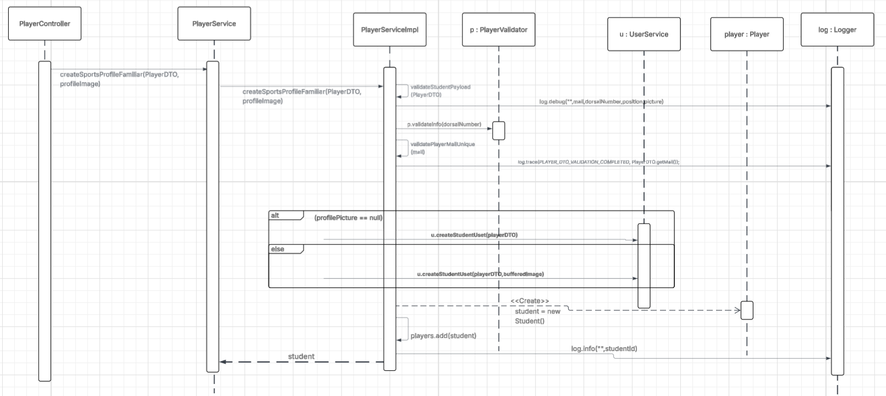 | Crear perfil deportivo - Familiar |
| 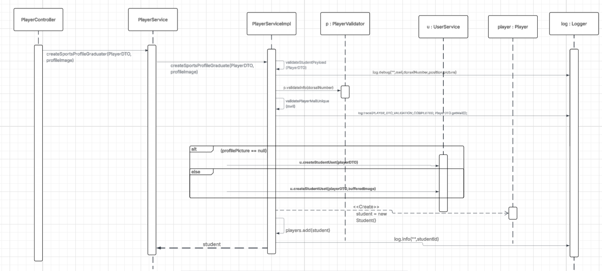 | Crear perfil deportivo - Egresado |
| 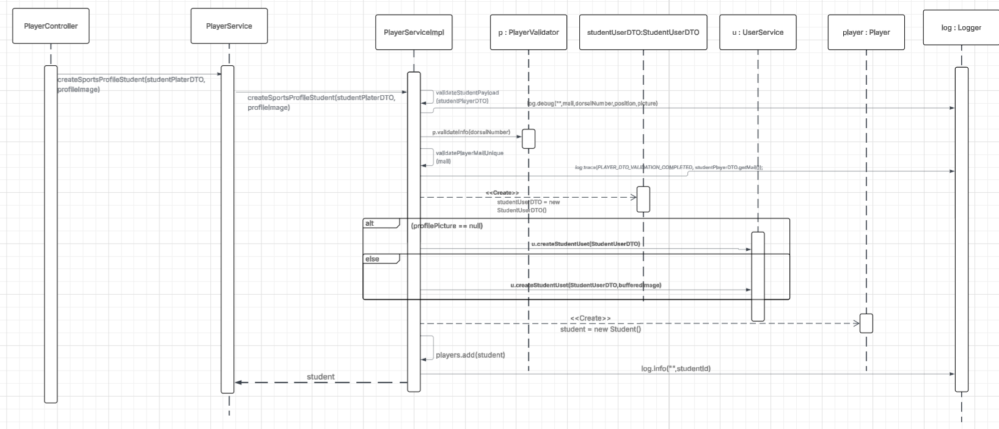 | Crear perfil deportivo - Estudiante |
| 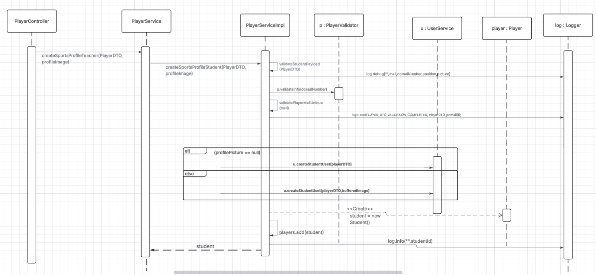 | Crear perfil deportivo - Profesor |
| 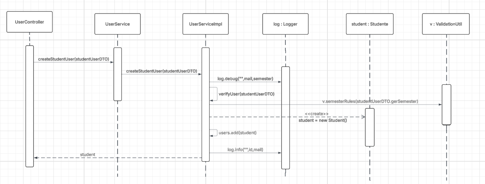 | Crear usuario estudiante |
| 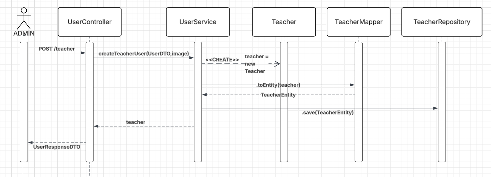 | Crear usuario profesor |
| 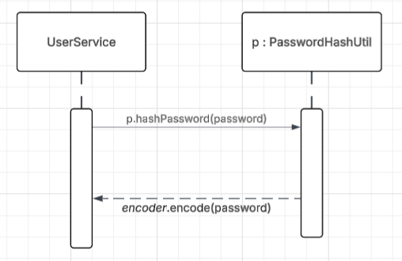 | Hash de contraseña |
| 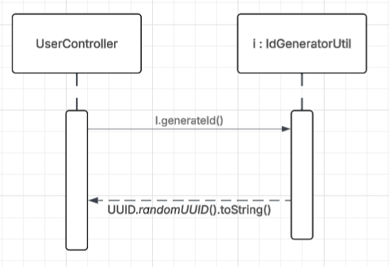 | Generador de ID |

### Módulo 3 (Equipos e invitaciones)

| Diagrama | Descripción |
|----------|-------------|
| 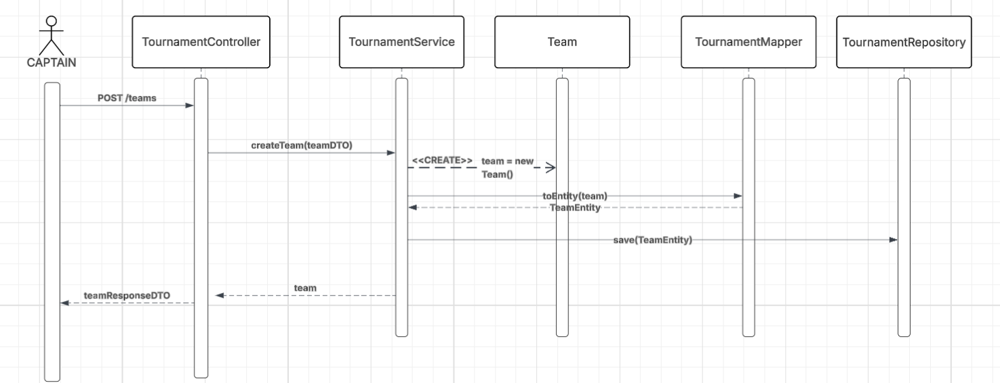 | Crear equipo |
|  | Manejar invitación |

### Módulo 7 (Partidos y árbitros)

| Diagrama                                                                | Descripción |
|-------------------------------------------------------------------------|-------------|
| 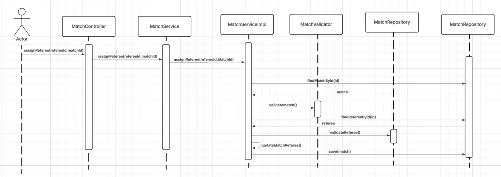               | Asignar árbitro |
| 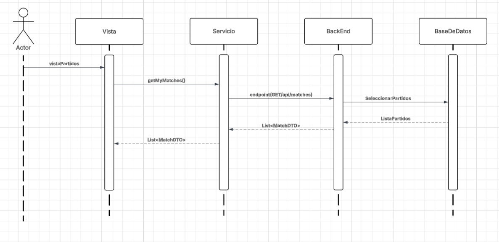 | Mostrar información de partidos |
| 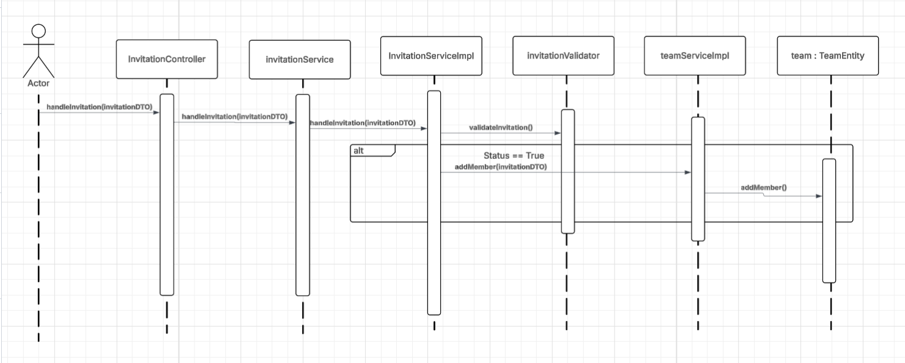             | Registrar partido |

## Despliegue con Docker

### Prerrequisitos

- [Docker](https://www.docker.com/get-started) instalado
- [Docker Compose](https://docs.docker.com/compose/install/) instalado
- Archivo `.env` configurado (ver `.env.example`)

### Configuración inicial


1. Crea tu archivo `.env` a partir del ejemplo:
```bash
cp .env.example .env
```

2. Edita el `.env` con tus valores reales (credenciales, secretos, etc.).

### Levantar el entorno local

```bash
docker-compose up --build
```

Esto levanta dos servicios:
- **db** — PostgreSQL 16 en el puerto `5432`
- **backend** — Spring Boot en el puerto `8443` (HTTPS)

### Verificar que está corriendo

```bash
docker-compose ps
```

Accede a la API en: `https://localhost:8443`

### Detener el entorno

```bash
docker-compose down
```

Para eliminar también los datos de la base de datos:
```bash
docker-compose down -v
```

### Estructura de archivos Docker

```
TechUpFutbol_Backend/
├── Dockerfile          # Imagen del backend
├── docker-compose.yml  # Orquestación de servicios
├── .dockerignore       # Archivos excluidos de la imagen
├── .env                # Variables de entorno reales (no subir al repo)
└── .env.example        # Plantilla de variables de entorno
```

### Notas importantes

- El archivo `.env` **nunca debe subirse al repositorio**. Está incluido en `.gitignore` y `.dockerignore`.
- El backend espera que la base de datos esté disponible antes de arrancar (healthcheck configurado).
- Los logs se guardan en la carpeta `logs/` del proyecto.