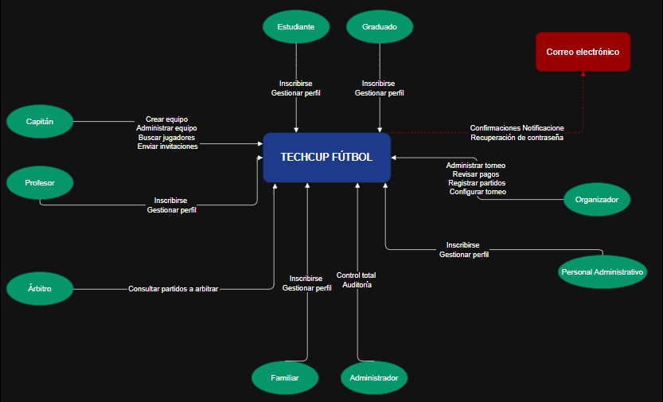

# HORUS EN OFFSIDE

## Integrantes

- Andres Felipe Cardozo
- Juan Camilo Cristancho
- Juan David Gómez
- Mariana Malagón
- Sebastian Castillejo 

## TechCup Fútbol

## Enunciado del problema

Actualmente, la organización de torneos estudiantiles de fútbol en la Escuela presenta retos significativos en la inscripción de equipos, registro de jugadores, manejo de pagos y seguimiento de resultados. No existe una plataforma integral que permita la gestión eficiente, segura y automatizada de todo el ciclo del torneo: desde la inscripción hasta la visualización de estadísticas y control disciplinario.

## Índice

1. [Diagrama de contexto del sistema](#diagrama-de-contexto-del-sistema)
2. [Definición de requerimientos](#definición-de-requerimientos)
    - [Funcionales](#requerimientos-funcionales)
    - [No funcionales](#requerimientos-no-funcionales)
3. [Análisis de requerimientos](#análisis-de-requerimientos)
4. [Mockup](#mockup)
5. [Manual de identidad](#manual-de-identidad)
6. [Jira: Gestión de tareas y funcionalidades](#jira)

---

## Diagrama de contexto del sistema

Explicación técnica del diagrama y las decisiones tomadas

El diagrama de contexto de TECHCUP FÚTBOL representa las principales interacciones entre los distintos actores del torneo y el sistema central. Se identifican los siguientes actores: estudiantes, profesores, graduados, personal administrativo, familiares, capitanes, árbitros, organizador y administrador. Cada uno cuenta con accesos y permisos específicos según su rol.

Las decisiones de diseño se fundamentan en la necesidad de ofrecer una plataforma que cubra todo el ciclo del torneo, desde la inscripción y gestión de perfiles hasta la administración de equipos, partidos y pagos. Se integró un mecanismo externo de pago (NEQUI/Efectivo), donde los usuarios realizan el pago y luego cargan el comprobante al sistema, asegurando trazabilidad y validación por parte del organizador.

El sistema distingue funcionalidades según el perfil del usuario; por ejemplo, el capitán puede crear y administrar equipos, buscar jugadores y enviar invitaciones, mientras que el organizador gestiona el calendario, pagos y resultados. Asimismo, el árbitro solo accede a la programación de los partidos asignados, y el administrador tiene control total y capacidades de auditoría.

Estas decisiones garantizan una separación clara de responsabilidades, menor acoplamiento y mayor cohesión entre módulos, contribuyendo a la seguridad, escalabilidad y facilidad de uso del sistema. Además, se facilita la integración con sistemas externos y el cumplimiento de requisitos administrativos del evento.

Entradas principales: solicitudes de inscripción, edición de perfil, creación de equipos, envío de invitaciones, subida de comprobantes de pago, configuración de torneo, registro de resultados y sanciones.
Salidas principales: confirmaciones, notificaciones, reportes de estado, listas de partidos asignados, información de equipos y jugadores filtrados, acceso a auditorías y resúmenes administrativos.

---

## Definición de requerimientos

### Requerimientos funcionales
### Requerimientos no funcionales

#### Por extensión y claridad, este análisis se presenta en un documento aparte: 
#### https://drive.google.com/file/d/1AOBtzUp4Ludo7ZzYN-Zx059rskGi4_KU/view?usp=sharing
---

## Análisis de requerimientos

#### Por extensión y claridad, este análisis se presenta en un documento aparte:  
#### https://drive.google.com/file/d/17BBAWJ_sIlNgE45yqnizIAVF_Hsg_3kc/view?usp=sharing

---

## Mockup

Enlace directo al prototipo de Figma:

https://pruebacorreoescuelaingeduco.sharepoint.com/:u:/s/DOSW-2026-1/IQD-QiEeKjhOTYxGCeboISZ5AXz-GYQBqVUc-zho2mgXGxg?e=Dg0aeS

Explicación:
Propuesta inicial de la aplicacion donde resaltamos cantidad de pantallas y flujos.

---

## Manual de identidad
https://pruebacorreoescuelaingeduco-my.sharepoint.com/:w:/g/personal/andres_cardozo-m_mail_escuelaing_edu_co/IQAVzek2k0baQ4d5eVeqO2pdAYt9ZoTT7_aCiT-z76HVTAM?rtime=zsOvmbJ73kg

Explicación: 
Manual de identidad donde definimos nuestra marca y se encuentra el enlace a presentacion.

---

## Jira: Gestión de tareas y funcionalidades

https://dosw-2026-01.atlassian.net/jira/software/projects/SCRUM/boards/1/backlog

---

## Sustento y justificación técnica

En este repositorio no sólo se encontrará los artefactos básicos, sino también el razonamiento y análisis detrás de cada decisión:  
- Cada requerimiento fue discutido y agrupado según las necesidades de bajo acoplamiento, alta cohesión y escalabilidad del sistema.
- Los módulos y funcionalidades fueron definidos tras analizar los flujos críticos del torneo estudiantil.
- El diseño visual y la lógica de roles se fundamentaron en principios de seguridad, usabilidad y la experiencia previa en sistemas similares.

---
