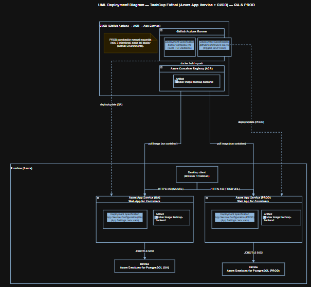

# HORUS EN OFFSIDE


## Integrantes

- Andres Felipe Cardozo
- Juan Camilo Cristancho
- Juan David Gómez
- Mariana Malagón
- Sebastian Castillejo 

## TechCup Fútbol

## Enunciado del problema

Actualmente, la organización de torneos estudiantiles de fútbol en la Escuela presenta retos significativos en la inscripción de equipos, registro de jugadores, manejo de pagos y seguimiento de resultados. No existe una plataforma integral que permita la gestión eficiente, segura y automatizada de todo el ciclo del torneo: desde la inscripción hasta la visualización de estadísticas y control disciplinario.

## Índice

1. [Diagrama de contexto del sistema](#diagrama-de-contexto-del-sistema)
2. [Definición de requerimientos](#definición-de-requerimientos)
    - [Funcionales](#requerimientos-funcionales)
    - [No funcionales](#requerimientos-no-funcionales)
3. [Análisis de requerimientos](#análisis-de-requerimientos)
4. [Arquitectura](#arquitectura)
5. [Manual de identidad](#manual-de-identidad)
6. [Jira: Gestión de tareas y funcionalidades](#jira)
7. [Diagramas de secuencia](#diagramas-de-secuencia)
8. [Diagrama de componentes general](#diagrama-de-componentes-general)
9. [Diagrama de componentes especificos](#diagrama-de-componentes-especificos)
10. [Diagrama de despliegue](#diagrama-de-despliegue)
11. [Diagrama de clases](#diagrama-de-clases)
12. [Sustento y justificación técnica](#sustento-y-justificación-técnica)
13. [Despliegue con Docker](#despliegue-con-docker)
---

## Diagrama de contexto del sistema


**Explicación:** Este diagrama delimita el sistema TECHCUP FÚTBOL y muestra cómo interactúan los actores principales con la plataforma. Resume el alcance funcional del proyecto: registro de usuarios, administración de perfiles deportivos, gestión de equipos, partidos, pagos, sanciones y consultas según el rol.

El sistema separa claramente los permisos por tipo de usuario. Los capitanes administran equipos e invitaciones, los organizadores controlan torneos, pagos y resultados, los árbitros consultan los partidos asignados y el administrador conserva capacidades de supervisión y auditoría.

También evidencia la integración con procesos externos como el pago y la carga de comprobantes, lo que permite trazabilidad y validación dentro del flujo de inscripción al torneo.

---

## Definición de requerimientos

### Requerimientos funcionales

### Requerimientos no funcionales

#### Documento de definición de requerimientos del sistema, donde se consolidan los requerimientos funcionales y no funcionales que delimitan el alcance del proyecto:
#### https://drive.google.com/file/d/1AOBtzUp4Ludo7ZzYN-Zx059rskGi4_KU/view?usp=sharing

## Análisis de requerimientos

#### Documento de análisis de requerimientos del sistema, donde se desarrollan y justifican las necesidades identificadas para el proyecto:  
#### https://1drv.ms/w/c/7d34c3acd28e130c/IQA1grpq8wYKT5Vyg6x0otSSAUKBbCGLtZLGRaYhcGPXc7Q?e=e3IsW9

---


## Arquitectura

#### Documento de arquitectura del sistema, donde se describe la estructura general de la solución, la organización de capas, los componentes principales y las decisiones técnicas adoptadas:
#### https://1drv.ms/w/c/7d34c3acd28e130c/IQAfWj_AG5bKT4UZDSs10honAU8gFO3hMa6E1Nb1qo87wek?e=cGd2Ee

---


## Manual de identidad
https://pruebacorreoescuelaingeduco.sharepoint.com/:p:/s/DOSW-2026-1/IQA1oPTMzFDaSpldO_fjkOzEAQrW69M2W3Ogkj8GeMJL3mQ?e=SzFiPT
Documento de manual de identidad visual, donde se definen los lineamientos de marca, colores, uso visual y presentación del proyecto.

---

## Jira

Tablero de Jira del proyecto, donde se organizan las tareas, funcionalidades y seguimiento del trabajo del equipo.
https://dosw-2026-01.atlassian.net/jira/software/projects/SCRUM/boards/1/backlog

---

## Diagrama de componentes general


**Explicación:** Este diagrama presenta la arquitectura general del backend y cómo se organizan sus capas y módulos principales. Permite entender la separación entre responsabilidades de negocio, exposición de servicios, persistencia e integración con componentes externos.

Además, muestra la base estructural sobre la que se implementan los procesos del sistema: autenticación, gestión de usuarios, equipos, partidos, pagos y estadísticas.

## Diagrama de componentes especificos


**Explicación:** Este diagrama detalla la interacción entre los componentes internos del sistema y sus dependencias directas. Se enfoca en cómo los módulos concretos colaboran para ejecutar los casos de uso del dominio deportivo.

Aquí se aprecia mejor la relación entre servicios de negocio, controladores, repositorios y entidades, lo que facilita mantener bajo acoplamiento y alta cohesión dentro de la aplicación.

## Diagrama de despliegue (Azure + CI/CD) — QA & PROD



Este **diagrama de despliegue UML** describe dónde se ejecuta el sistema **TechCup Fútbol** en Azure, qué **artefactos** se despliegan en cada nodo y cómo se conectan los componentes en los ambientes **QA** y **PROD**. El diagrama está dividido en dos zonas: **CI/CD** (entrega) y **Runtime (Azure)** (ejecución).

---

### 1) Componentes / Nodos / Artefactos

#### CI/CD (GitHub Actions → ACR → App Service)
- **GitHub Actions Runner (Node)**
    - Es el entorno de ejecución del pipeline de automatización.
    - Contiene dos **Deployment Specifications**:
        - **`docker-compose.yml`**: especificación usada para orquestación/validación en entorno local y/o validaciones en CI (por ejemplo, levantar servicios para pruebas).
        - **`.github/workflows/ci-cd.yml`**: especificación del flujo de CI/CD (build, push, y despliegue) para QA y PROD.
    - Incluye una nota de control para producción:
        - **PROD requiere aprobación manual** (mínimo 3 miembros) antes de ejecutar el despliegue usando **GitHub Environments**.

- **Azure Container Registry (ACR) (Node)**
    - Registro donde se almacena el **Artifact** principal:
        - **Docker Image: `techcup-backend:<tag>`** (la imagen del backend que se publicará y luego será consumida por los App Services).

#### Runtime (Azure)
- **Desktop client (Browser / Postman)**
    - Representa al usuario/cliente que consume la API (navegador o Postman).

- **Azure App Service (QA) — Web App for Containers (Node)**
    - Entorno de ejecución del backend en **QA**.
    - Contiene:
        - **Deployment Specification: App Service Configuration (QA)** (App Settings / variables de entorno, por ejemplo `DB_*`).
        - **Artifact: Docker Image `techcup-backend:<tag>`**, que es la imagen que se ejecuta como contenedor en QA.

- **Azure App Service (PROD) — Web App for Containers (Node)**
    - Entorno de ejecución del backend en **PROD**.
    - Contiene:
        - **Deployment Specification: App Service Configuration (PROD)** (App Settings / variables de entorno).
        - **Artifact: Docker Image `techcup-backend:<tag>`**, ejecutada como contenedor en producción.

- **Azure Database for PostgreSQL (QA) (Device)**
    - Base de datos administrada para el ambiente **QA**.

- **Azure Database for PostgreSQL (PROD) (Device)**
    - Base de datos administrada para el ambiente **PROD**.

---

### 2) Conexiones (enlaces de comunicación) y su significado

#### Build & Push (CI/CD)
- **GitHub Actions Runner → Azure Container Registry (ACR)**: `docker build + push`
    - El pipeline construye la imagen Docker del backend y la publica en el registro ACR.

#### Deploy/Update (automatización de despliegue)
- **GitHub Actions Runner → Azure App Service (QA)**: `deploy/update (QA)` *(línea punteada)*
    - Representa el paso de despliegue hacia QA, donde el pipeline actualiza la configuración del App Service para apuntar a la nueva versión/tag de la imagen.

- **GitHub Actions Runner → Azure App Service (PROD)**: `deploy/update (PROD)` *(línea punteada)*
    - Representa el despliegue hacia producción. Este paso está controlado por aprobaciones manuales (GitHub Environments).


#### Distribución del artefacto (imagen Docker)
- **Azure Container Registry (ACR) → Azure App Service (QA)**: `pull image (run container)`
    - El App Service de QA obtiene (pull) la imagen desde ACR y ejecuta el contenedor.

- **Azure Container Registry (ACR) → Azure App Service (PROD)**: `pull image (run container)`
    - El App Service de producción obtiene (pull) la imagen desde ACR y ejecuta el contenedor.

#### Acceso del cliente a la API
- **Desktop client → Azure App Service (QA)**: `HTTPS 443 (QA URL)`
    - El cliente consume la API publicada en el App Service de QA vía HTTPS.

- **Desktop client → Azure App Service (PROD)**: `HTTPS 443 (PROD URL)`
    - El cliente consume la API en producción vía HTTPS.

#### Conexión a base de datos
- **Azure App Service (QA) → Azure Database for PostgreSQL (QA)**: `JDBC/TLS 5432`
    - La aplicación en QA se conecta a su base de datos usando TLS sobre el puerto 5432.

- **Azure App Service (PROD) → Azure Database for PostgreSQL (PROD)**: `JDBC/TLS 5432`
    - La aplicación en producción se conecta a su base de datos usando TLS sobre el puerto 5432.

---

### 3) Resumen del flujo extremo a extremo

1. Un cambio en el repositorio dispara el workflow de **GitHub Actions**.
2. Actions construye y publica la imagen **`techcup-backend:<tag>`** en **ACR**.
3. Actions ejecuta el paso de **deploy/update** hacia **QA** o **PROD** (en PROD con aprobación manual).
4. Cada **App Service** hace **pull** de la imagen desde ACR y ejecuta el contenedor.
5. Los usuarios consumen la API por **HTTPS 443** y la aplicación accede a PostgreSQL por **JDBC/TLS 5432** en el ambiente correspondiente.


## Diagrama de clases


**Explicación:** Este diagrama representa el modelo de dominio del proyecto y las relaciones entre sus entidades principales. Muestra cómo se conectan usuarios, perfiles deportivos, equipos, invitaciones, torneos, partidos, pagos y sanciones.

Su objetivo es dejar claras las cardinalidades, herencias y asociaciones que soportan las reglas de negocio del sistema, especialmente las restricciones de roles, pertenencia a equipos y seguimiento de resultados.

---

## Diagramas de secuencia

Documento técnico de diagramas de secuencia, donde se agrupan los flujos de interacción del sistema por módulo funcional. Puedes consultarlo aquí:

[Ver documento de diagramas de secuencia](./docs/UML/secuencia/README.md)

## Sustento y justificación técnica

En este repositorio no sólo se encontrará los artefactos básicos, sino también el razonamiento y análisis detrás de cada decisión:
- Cada requerimiento fue discutido y agrupado según las necesidades de bajo acoplamiento, alta cohesión y escalabilidad del sistema.
- Los módulos y funcionalidades fueron definidos tras analizar los flujos críticos del torneo estudiantil.
- El diseño visual y la lógica de roles se fundamentaron en principios de seguridad, usabilidad y la experiencia previa en sistemas similares.

---

## Despliegue con Docker

### Prerrequisitos

- [Docker](https://www.docker.com/get-started) instalado
- [Docker Compose](https://docs.docker.com/compose/install/) instalado
- Archivo `.env` configurado (ver `.env.example`)

### Configuración inicial


1. Crea tu archivo `.env` a partir del ejemplo:
```bash
cp .env.example .env
```

2. Edita el `.env` con tus valores reales (credenciales, secretos, etc.).

### Levantar el entorno local

```bash
docker-compose up --build
```

Esto levanta dos servicios:
- **db** — PostgreSQL 16 en el puerto `5432`
- **backend** — Spring Boot en el puerto `8443` (HTTPS)

### Verificar que está corriendo

```bash
docker-compose ps
```

Accede a la API en: `https://localhost:8443`

### Detener el entorno

```bash
docker-compose down
```

Para eliminar también los datos de la base de datos:
```bash
docker-compose down -v
```

### Estructura de archivos Docker

```
TechUpFutbol_Backend/
├── Dockerfile          # Imagen del backend
├── docker-compose.yml  # Orquestación de servicios
├── .dockerignore       # Archivos excluidos de la imagen
├── .env                # Variables de entorno reales (no subir al repo)
└── .env.example        # Plantilla de variables de entorno
```

### Notas importantes

- El archivo `.env` **nunca debe subirse al repositorio**. Está incluido en `.gitignore` y `.dockerignore`.
- El backend espera que la base de datos esté disponible antes de arrancar (healthcheck configurado).
- Los logs se guardan en la carpeta `logs/` del proyecto.
