## Diagramas de Secuencia

A continuación se presentan los diagramas de secuencia organizados por módulo:

### Módulo 1 - Gestión de Usuarios y Perfiles Deportivos

| Diagrama | Descripción |
|----------|-------------|
|  | Creación de usuario administrador |
|  | Creación de usuario familiar |
|  | Creación de usuario graduado |
|  | Creación de usuario organizador |
|  | Creación de usuario árbitro |
| 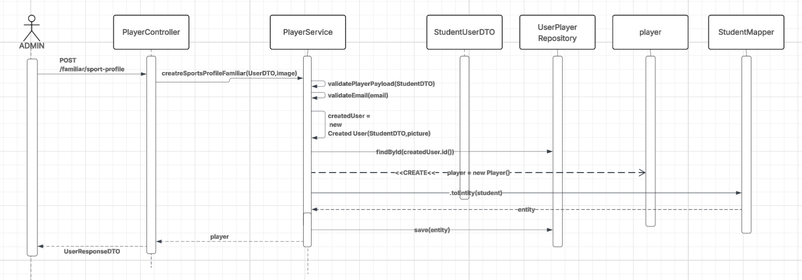 | Creación de perfil deportivo (familiar) |
| 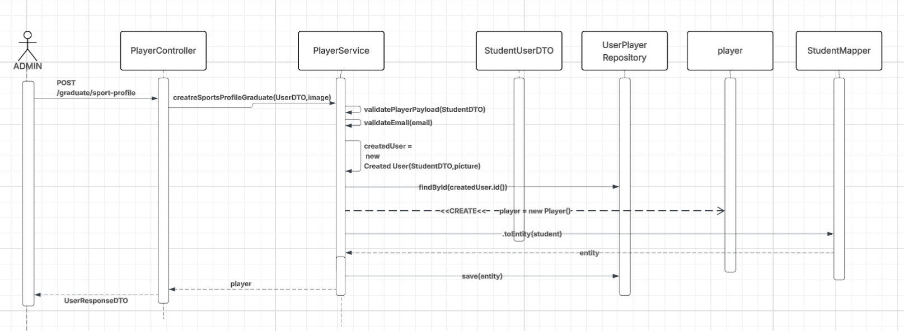 | Creación de perfil deportivo (graduado) |
| 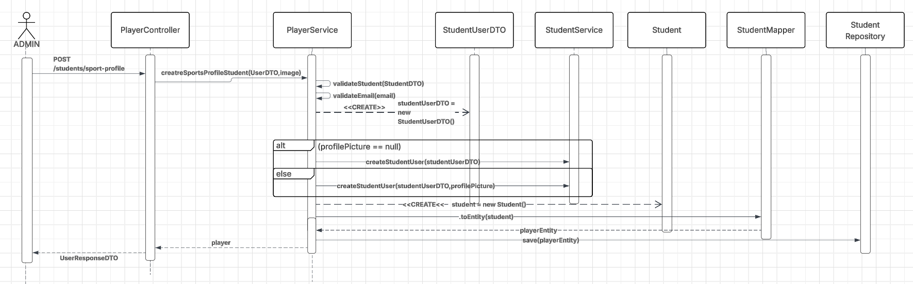 | Creación de perfil deportivo (estudiante) |
| 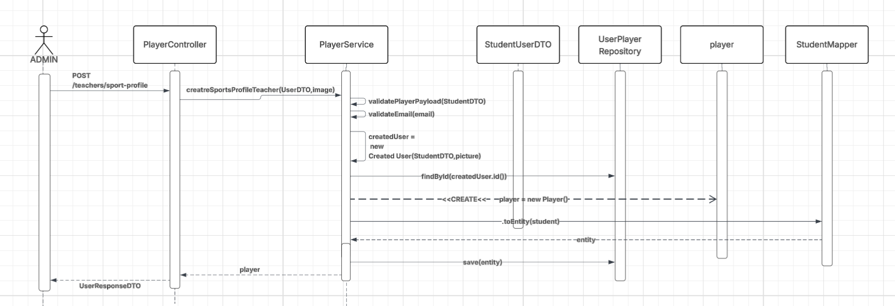 | Creación de perfil deportivo (profesor) |
|  | Creación de usuario estudiante |
|  | Creación de usuario profesor |

### Módulo 2 - Gestión de Torneos

| Diagrama | Descripción |
|----------|-------------|
| 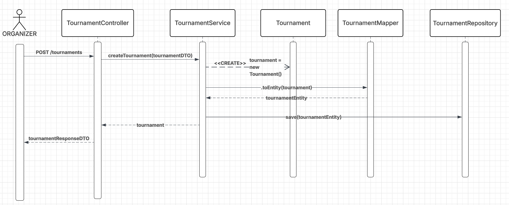 | Creación de torneo |
| 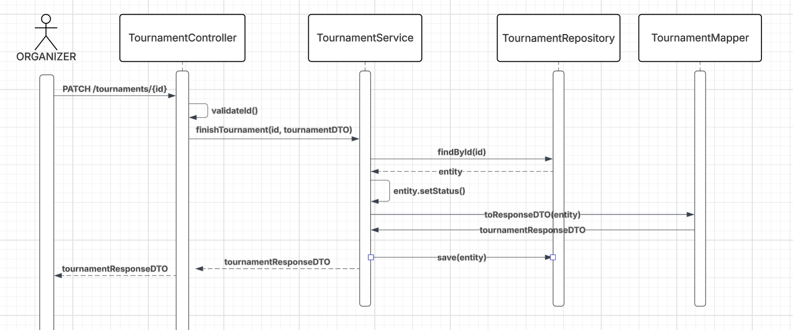 | Finalización de torneo |
| 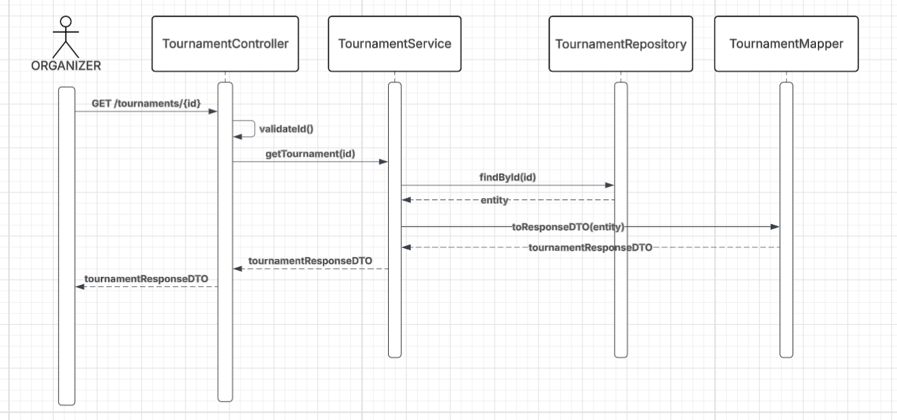 | Obtención de torneo |
| 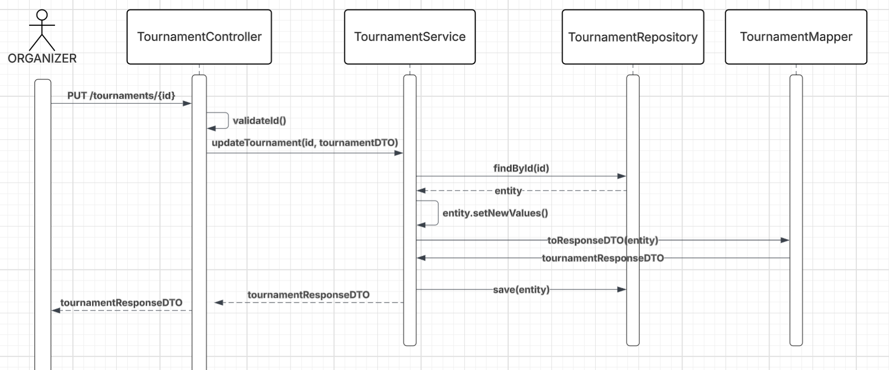 | Actualización de torneo |

### Módulo 3 - Gestión de Equipos e Invitaciones

| Diagrama | Descripción |
|----------|-------------|
|  | Creación de equipo |
|  | Gestión de invitaciones |
| 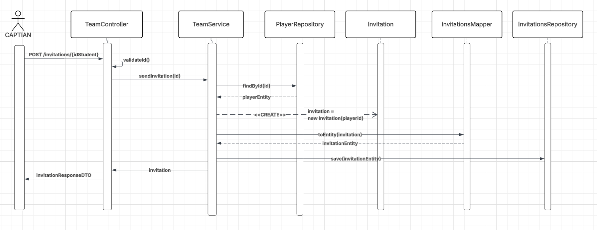 | Envío de invitación |

### Módulo 4 - Filtros

| Diagrama | Descripción |
|----------|-------------|
| 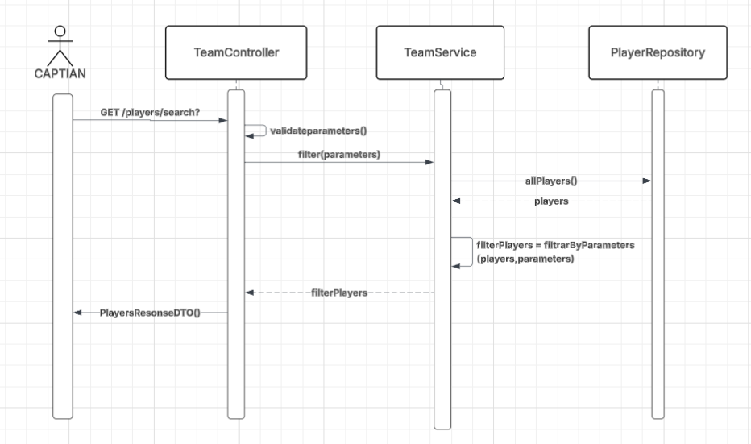 | Filtrado de información |

### Módulo 5 - Gestión de Pagos

| Diagrama | Descripción |
|----------|-------------|
| 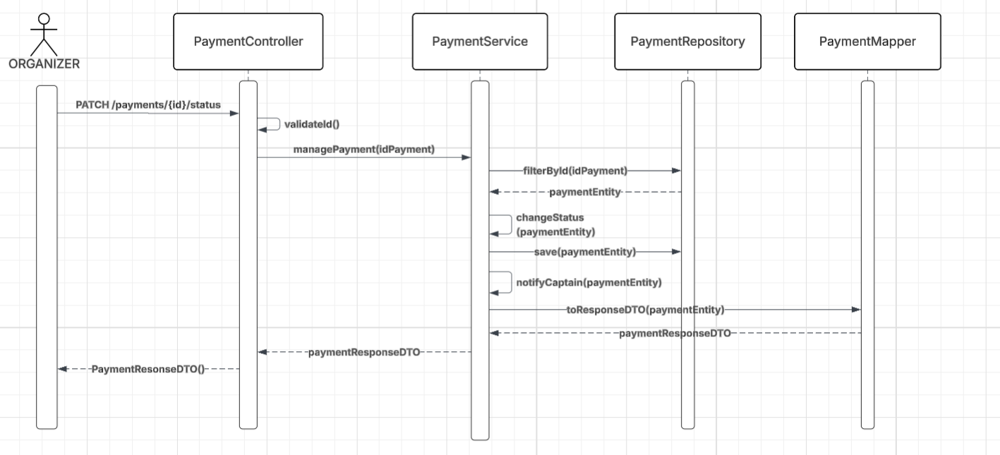 | Administración de pagos |
| 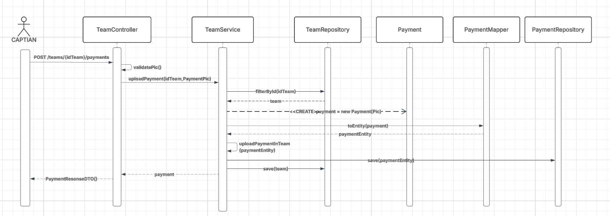 | Subida de comprobante de pago |

### Módulo 6 - Formaciones

| Diagrama | Descripción |
|----------|-------------|
| 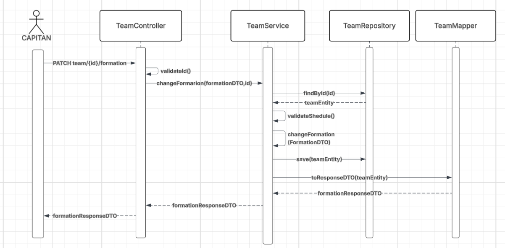 | Cambio de formación táctica |
| 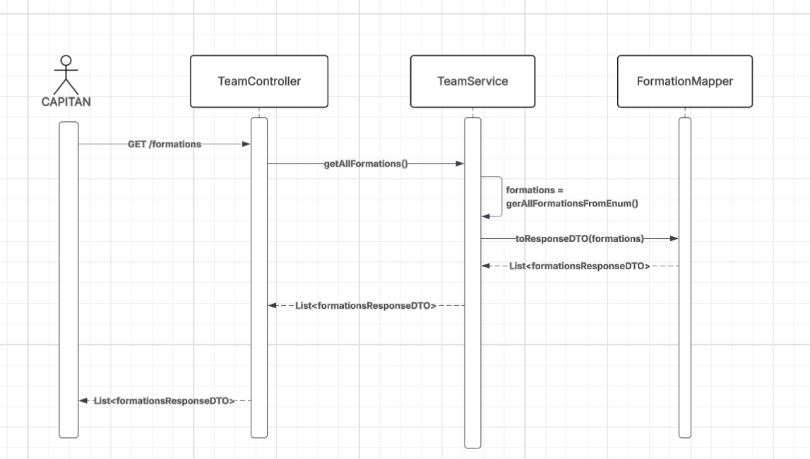 | Obtención de todas las formaciones |
| 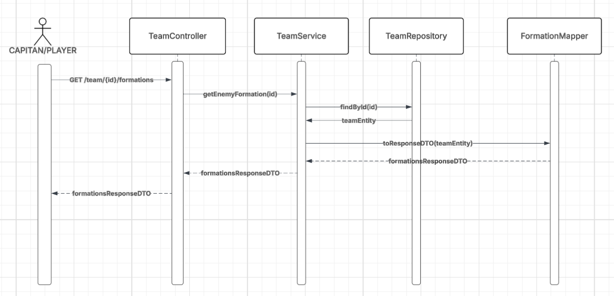 | Visualización de formación del rival |

### Módulo 7 - Gestión de Partidos y Árbitros

| Diagrama | Descripción |
|----------|-------------|
| 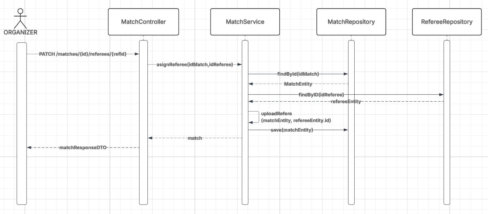 | Asignación de árbitro a partido |
| 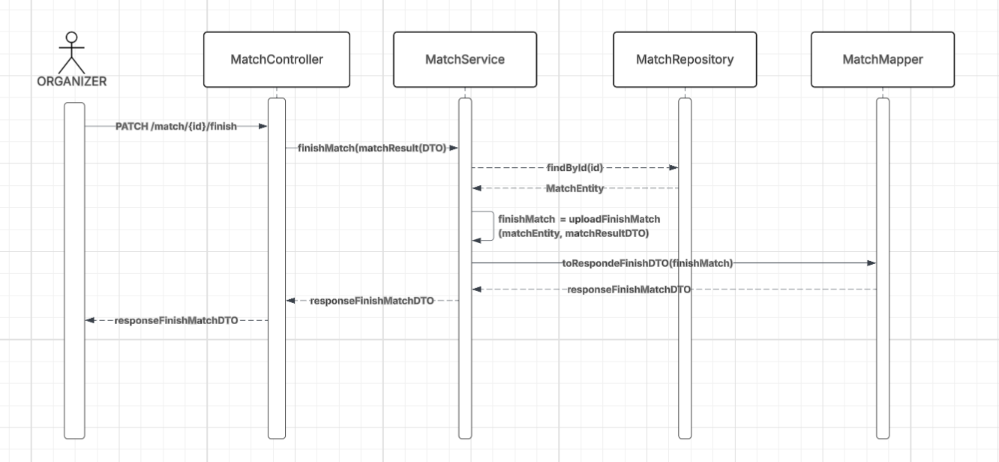 | Finalización de partido |
| 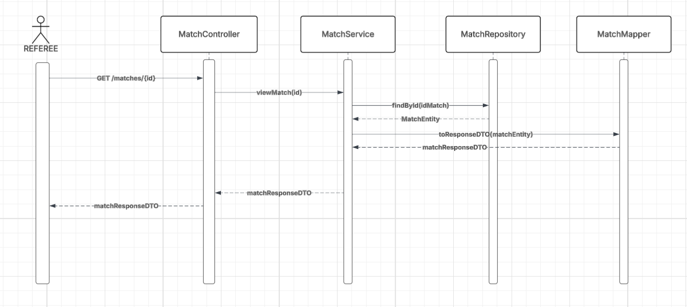 | Visualización de detalles del partido |